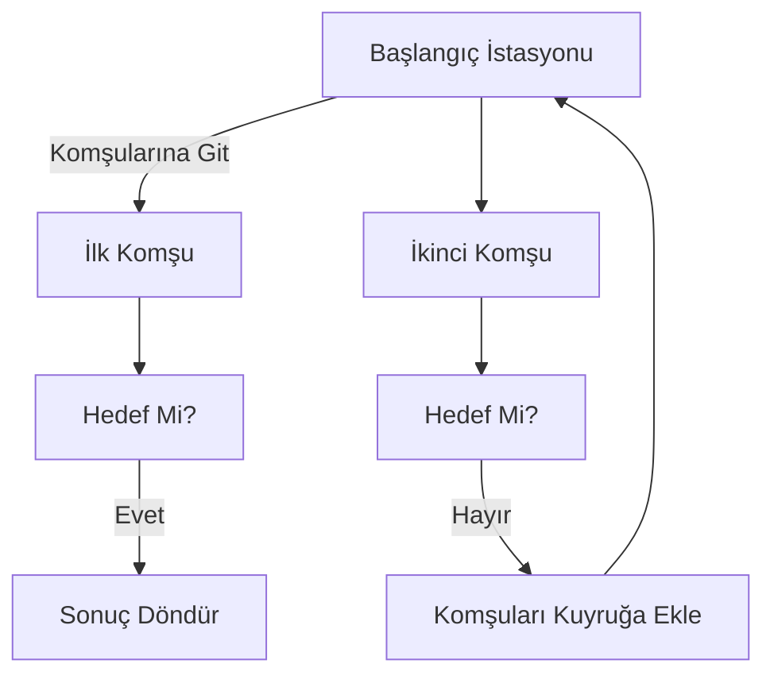
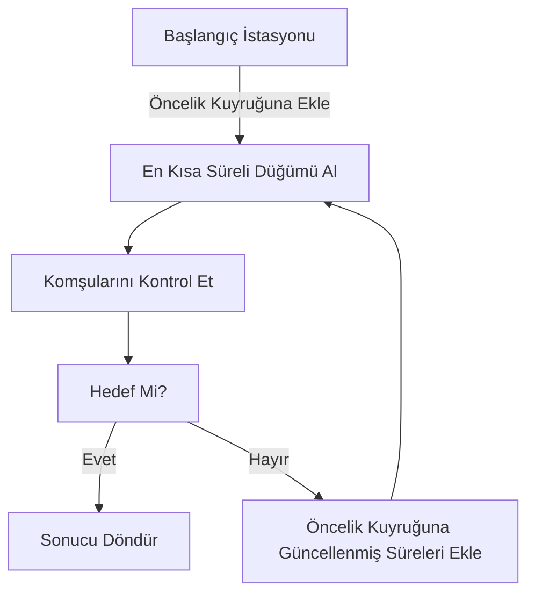

# Metro Ağı Simülasyonu

## 1. Proje Başlığı ve Kısa Açıklama

Bu proje, bir metro ağı simülatörüdür. Python kullanılarak geliştirilen bu proje, belirli bir metro hattı üzerinde en az aktarmalı rotayı ve en hızlı rotayı bulmayı amaçlar.

### **Projenin Amaçları:**

- Kullanıcının belirlediği başlangıç ve hedef istasyonlar arasında **en az aktarma** yaparak ulaşımı sağlamak.
- Kullanıcının belirlediği başlangıç ve hedef istasyonlar arasında **en hızlı rota** hesaplamak.
- Gerçek dünya metro sistemlerine benzer bir yapı sunarak ağ analizlerini mümkün kılmak.

---

## 2. Kullanılan Teknolojiler ve Kütüphaneler

### **Python Kütüphaneleri:**

- **collections**: Özellikle `deque` veri yapısını kullanarak **BFS (Genişlik Öncelikli Arama)** algoritmasını optimize etmek için kullanılmıştır.
- **heapq**: A* algoritmasının öncelik kuyruğu veri yapısını yönetmek için kullanılmıştır.
- **typing**: Tür belirleyici olarak `Dict`, `List`, `Tuple` gibi veri yapılarını daha okunaklı hale getirmek için kullanılmıştır.

---

## 3. Algoritmaların Çalışma Mantığı

### **BFS Algoritması (En Az Aktarmalı Rota)**

- BFS (Breadth-First Search), **en kısa adım sayısını** bulmaya yönelik bir arama algoritmasıdır.
- Bu projede **en az aktarmalı rota** bulmak için kullanılmıştır.
- **Çalışma Mantığı:**
  1. Başlangıç istasyonunu kuyruğa ekler.
  2. Her iterasyonda mevcut istasyonu kontrol eder.
  3. Eğer hedef istasyon bulunursa durur ve sonucu döndürür.
  4. Komşu istasyonları sırayla kuyruğa ekler ve ziyaret edildiğini işaretler.

#### **BFS Görselleştirilmiş Akış Şeması:**



---

### **A* Algoritması (En Hızlı Rota)**

- A* algoritması, **en kısa süreyi** hesaplamak için kullanılmıştır.
- **Öncelikli Kuyruk (Priority Queue) kullanarak** en düşük süreli yolu öncelikli olarak inceler.
- **Çalışma Mantığı:**
  1. Başlangıç istasyonunu öncelik kuyruğuna ekler.
  2. Süresi en düşük olan istasyonu kuyruğun başına alır.
  3. Hedef istasyon bulunursa süre ile birlikte sonucu döndürür.
  4. Komşu istasyonları kuyruğa ekler ve günceller.

#### **A* Algoritması Akış Şeması:**



---

## 4. Örnek Kullanım ve Test Sonuçları

```python
# Örnek Metro Ağı Tanımlama
metro = MetroAgi()
metro.istasyon_ekle("M1", "AŞTİ", "Mavi Hat")
metro.istasyon_ekle("M2", "Kızılay", "Mavi Hat")
metro.baglanti_ekle("M1", "M2", 5)

# En Az Aktarmalı Rota
rota = metro.en_az_aktarma_bul("M1", "M2")
print("En az aktarmalı rota:", " -> ".join(i.ad for i in rota))

# En Hızlı Rota
rota, sure = metro.en_hizli_rota_bul("M1", "M2")
print(f"En hızlı rota ({sure} dakika):", " -> ".join(i.ad for i in rota))
```

### **Örnek Test Senaryoları**

| Başlangıç | Hedef    | En Az Aktarmalı Rota                      | En Hızlı Rota ve Süre                             |
| --------- | -------- | ----------------------------------------- | ------------------------------------------------- |
| AŞTİ      | OSB      | AŞTİ -> Kızılay -> OSB                    | AŞTİ -> Kızılay -> OSB (10 dk)                    |
| Batıkent  | Keçiören | Batıkent -> Demetevler -> Gar -> Keçiören | Batıkent -> Demetevler -> Gar -> Keçiören (14 dk) |
| Keçiören  | AŞTİ     | Keçiören -> Gar -> Kızılay -> AŞTİ        | Keçiören -> Gar -> Kızılay -> AŞTİ (11 dk)        |

---

## 5. Projeyi Geliştirme Fikirleri

- **Gerçek Metro Verisi ile Entegrasyon:** Daha gerçekçi veriler kullanarak projeyi genişletmek.
- **Grafik Arayüz (GUI) Desteği:** Kullanıcıların harita üzerinde istasyon seçebileceği bir arayüz oluşturmak.
- **Gerçek Zamanlı Trafik ve Gecikme Durumu:** Gerçek zamanlı tren yoğunluğu ve gecikmeleri hesaba katarak daha dinamik bir sistem tasarlamak.
- **Farklı Ulaşım Modları ile Entegrasyon:** Otobüs, tramvay gibi diğer ulaşım türlerini de hesaba katarak bir "şehir içi ulaşım optimizasyonu" sunmak.
